# Content modules v2 walkthrough

Implemented in the isolated `claude-kitten-content-v2` worktree, branch `feat/content-modules-v2`, based on `f199b33`. This integration branch covers all seven planned phases and the added Settings menu. Checks were run during implementation and against the complete result; separate phase branches were not created.

## What ships

Thirteen content registries hold one TypeScript file per item. The new engines cover scripted moves, Claude reactions, pair play and capped bonds, expeditions with frozen rewards, daily quest chains, seasonal exchanges/boosts and Pip's Curio crafting. The late pack adds nine level-gated skills, five tier-gated furniture pieces, maps, consumable gear, two permanent charms and tea. All thirteen generator skills are mirrored byte-for-byte.

The four open decisions use the proposed defaults: expedition cats leave the yard and band until claim; slots grow at House, Manor and Castle (maximum four); parties start at one to three cats; timers use wall clock and manual claiming; Pip is always open. Matriarch allows a fourth party member. Expedition permit adds a slot within the four-slot cap.

Save version stays 3. Existing ids and the original skill/furniture/shop order are retained. Old v3 households inherit new fields without losing cats, skills, owned items or decor. The 40-day stock fixture and captured legacy skill totals are unchanged after the late pack.

Two small content details make the progression loop work: Harbor map unlocks Riverbank using garden feathers, and Star map costs neon scrap available before Moon Crater opens. Pumpkin quest steps count claimed pumpkin quantities rather than the number of expeditions. Loot, material boosts and reward amounts freeze at departure; Astral accelerates offline time without rerolling loot.

## Try the progression loop

1. Load this worktree with `claude --plugin-dir E:/code_project/OSS/CatOSSWorks/claude-kitten-content-v2` and open `/cat expedition` (`x`).
2. Select an awake cat with ten energy and ten coins. Choose Garden Patrol, then use Send (`d`) or focus the keyboard row and press Enter. Left/right selects a single cat; the buttons can assemble a larger party and equip gear.
3. The cat leaves the yard. With everyone away, the scene and its accessible fallback show an away sign; the running band uses paw prints.
4. After fifteen minutes, the ready toast and claim button appear. `/cat claim` collects all ready parties once; `/cat claim <run-id>` collects one. Offline completions wait in the inbox.
5. Gather feathers for Harbor map, shells from Riverbank and pine cones from Deep Woods. Open `/cat curio` and craft with `/cat craft <id>` or its buttons. Map table requires Villa, 1200 coins and ten pine cones.
6. Open `/cat quests` for two seeded daily chains beside Paw Miles. Pumpkin Patch and pumpkin chains are eligible in October; Snow Trail runs December–February. December exchange buttons appear in Friends and accept household cats or visitors.

## Settings and sound

Open `/cat settings` or the Settings tab (`v`). Every declared plugin setting is displayed from the host's current configuration: flavor, interface skin, pane canvas, reactions and sound. Choice buttons and the sound toggle persist immediately and update the running session. Sound preview plays the level-up clip only while sound is enabled. Locked settings are shown as managed; a refused write leaves the accepted configuration and runtime state intact.

The same menu changes Claude Code's Catppuccin theme, the yard world, weather units/location/off, and arcade glow/CRT. Theme and plugin settings save through the host; household preferences save with the cats. Browser-only fit/1×–6× and fullscreen controls remain in the arcade Display menu.

## Verification evidence

Final gameplay/UI run: **227 passed, 0 failed across 47 files**. Server and content-tool checks add four passing Node tests.

- The gameplay suite covers deterministic loot, spending once, party/slot/unlock gates, away cats, offline completion, single claims, material quantity quests, seasonal boosts/exchanges, bonds, level/tier gating and old v3 migration.
- Native UI integration tests send from the Expeditions keyboard row, simulate an offline return, claim, craft and navigate quests. October eligibility and all-away care guards are exercised on terminal and desktop surfaces.
- Native tool-hook integration checks test-pass celebration and reaction-off behavior. Pure tests check command recognition, failure/long-command signals, cooldowns and seeded odds.
- Settings integration checks all five host config writes, immediate sound mute/preview, refused writes and saved household preferences across pane remounts. Fine and half-block rendering tests exercise all three new poses and fractional-position cup falls.
- Node checks pin append-only registry behavior, reject stale barrels and compare every mirrored skill file. All thirteen skills pass `quick_validate.py`.
- The manifest, both TypeScript projects, server tests and content freshness check pass. `server/public/arcade.js` was rebuilt.

Integration tests use mocked time, tool results, configuration, storage and audio. A separate interactive live session with a real failing Bash command, `sleep 30`, audible playback and a real fifteen-minute wait has not been run. To check it locally: enable reactions and sound, run a failing Bash command, a passing test command, then `sleep 30` (nap begins after twenty seconds). Send Garden Patrol, leave it running or close/reopen the plugin, and claim after its wall-clock deadline. These steps are manual follow-up, not claimed automated results.

## Preview gallery

Move strips show both facings over one cycle; window and shelf moves include their landmark, and Cup Knock shows the full sixteen-frame fall. Pair strips show successive approach/interaction frames with a full-size partner. Furniture sheets show Latte, Frappé, Macchiato and Mocha from top to bottom. These PNGs are generated by `tools/preview.mjs` and were visually inspected.

### Moves

**chase-tail**

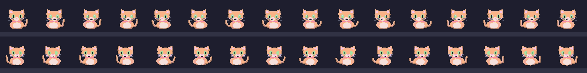

**window-watch**

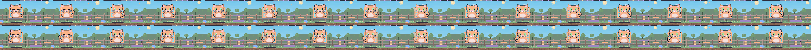

**cup-knock**

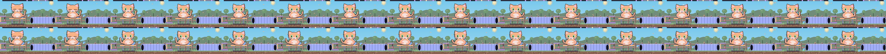

**knead**

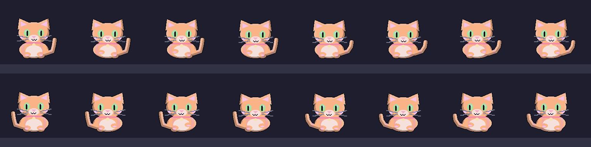

**sneak-attack**

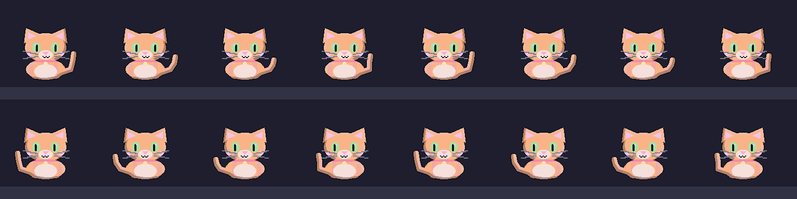

**hiss**

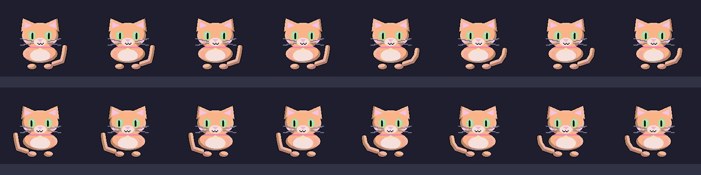

### Pair play

**nose-boop**

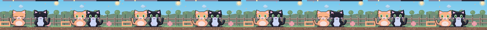

**play-fight**

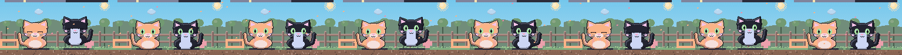

**chase**

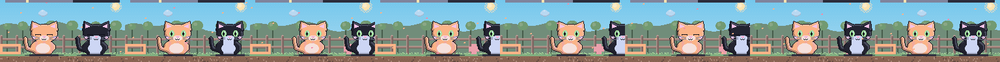

**groom-buddy**

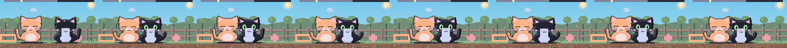

**nap-pile**

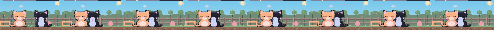

### Late furniture

**map-table**

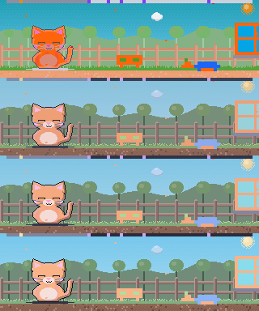

**shell-fountain**

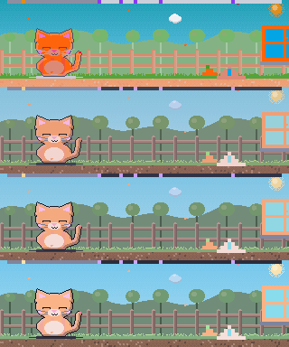

**neon-sign**

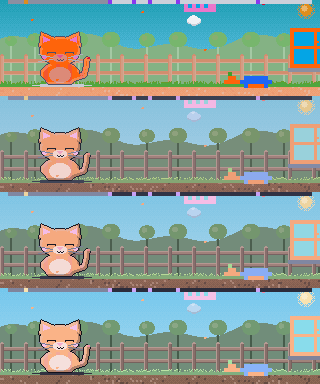

**moon-hammock**

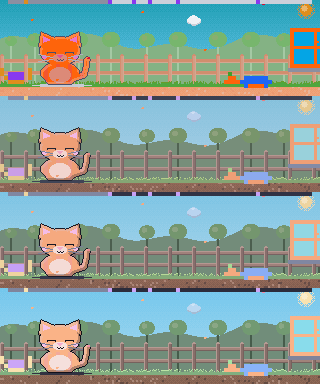

**starlit-rug**

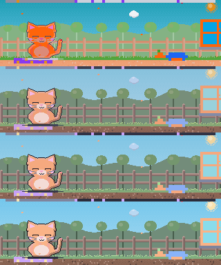
